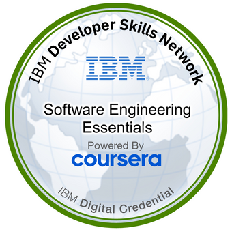
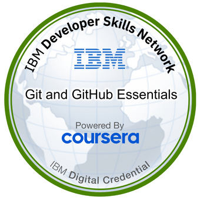
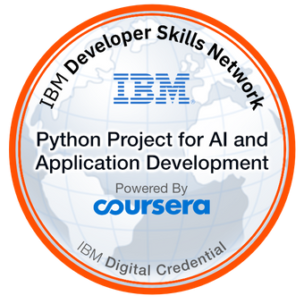

<!--  Profile Widget  -->

<!-- Reference: https://github.com/Jurredr/github-widgetbox -->

<!-- -------Header------- -->

  

 
<!-- Bio -->
- 👋 Hello! I'm Harold Villacis, a Software Engineering with a strong foundation and notable projects
- 💪 I'm skilled in Back-end development. 
- ⚙️ My advanced skills include Python, Machine Learning, Django, Flask, SQL, Docker, Kubernetes, Git/GitHub.
<!-- 🌱 I love to tackle complex Data Structures and Algorithms problems on **[Leetcode](https://leetcode.com/umairazmat/)**.-->
- 👯 I’m looking to collaborate with other content creators and developers.
- 🥅 2023 Goals: Expand my knowledge and skills in software development.
- 📫 How to reach me **haroldavidvj@hotmail.com**
- 📩 Don't hesitate to reach out & let's connect and start a conversation. 📞
- 🤝 Let's connect and explore how I can contribute to your projects or provide valuable insights. Together, we can create remarkable digital solutions that leave a lasting impact. 💼✨

## 🤝🏻 &nbsp;Connect with Me

 </a>

<!-- quote -->

<!-- reference = https://github.com/PiyushSuthar/github-readme-quotes -->
 

 

  

<h2><i>🏅 Awards &  Badges</i></h2>

   

   

   

   

   

   

   

## 🧑‍💻 Tech Stack 🛠️

<!-- tech stack -->

<!-- reference = https://github.com/tandpfun/skill-icons -->
 

  

